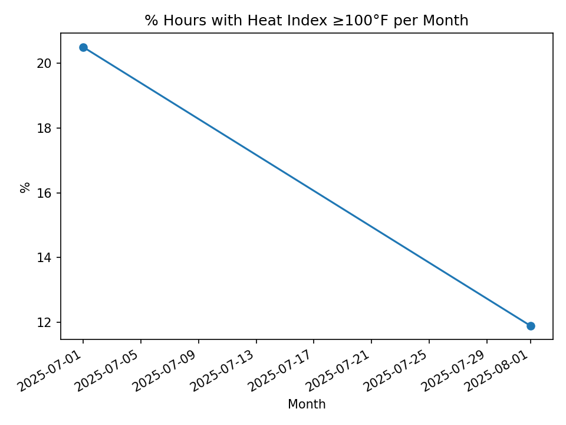
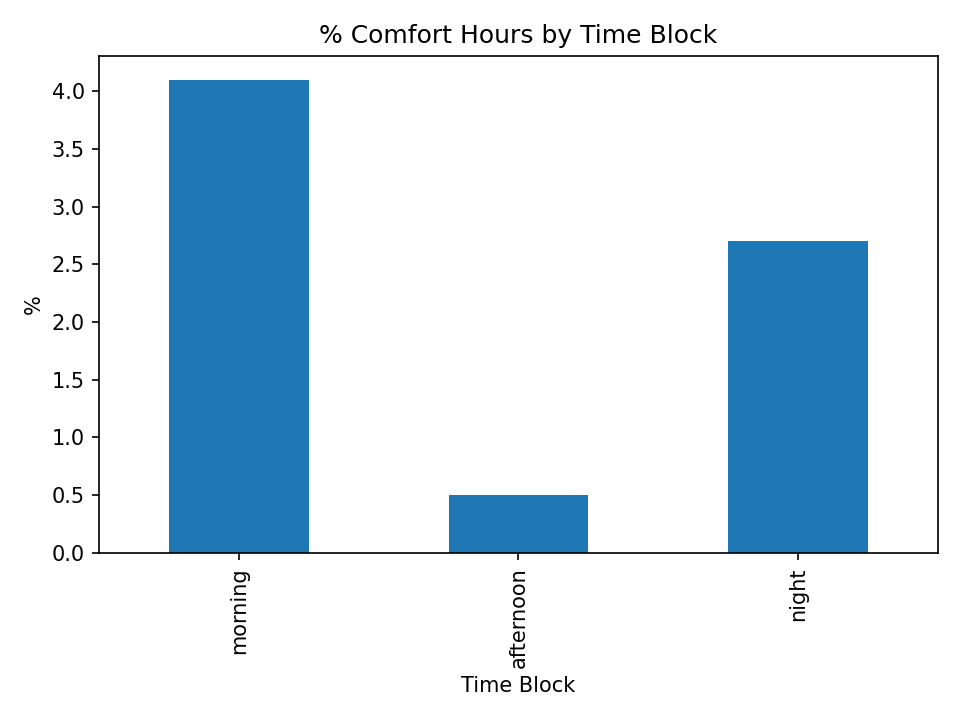
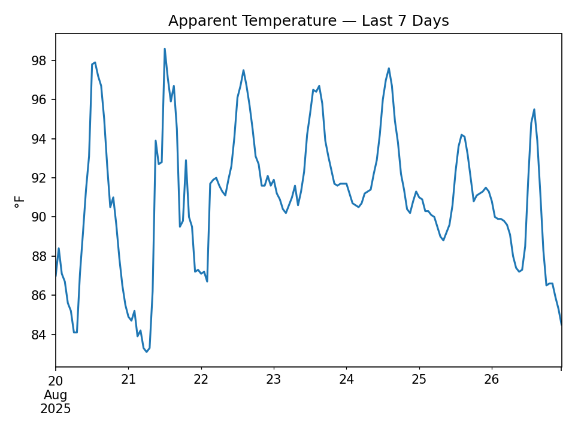

# ☀️🌡️ Largo Weather KPI Dashboard

Short, focused climate analytics for Largo, Florida (Summer 2025).  
I fetch hourly data from the **Open-Meteo API**, compute practical KPIs, and publish an interactive **Looker Studio** dashboard. This repo contains the data snapshots, charts, and the reproducible notebook.

---

## 📂 Data
- **Source:** Open-Meteo API (hourly)
- **Period:** last ~5 weeks
- **Fields:** apparent_temperature, relative_humidity_2m, precipitation_probability, time
- Snapshots are in [`/data`](data) and preview charts in [`/figs`](figs).

---

## 📊 Main KPIs
1. **% of hours with Heat Index ≥ 100°F** (by month)  
2. **% of days with Rain Probability ≥ 60%** (overall)  
3. **Comfort windows by time of day** (72–90°F and RH < 70%)

---

## 📊 Results (Auto-generated snapshot)

**KPI1 — % of hours with Heat Index ≥100°F (by month)**  
See details in [`data/kpi_hours_HI100_per_month.csv`](data/kpi_hours_HI100_per_month.csv)

**KPI2 — % of days with rain probability ≥60% (overall)**  
See [`data/kpi_days_rain60.csv`](data/kpi_days_rain60.csv)

**KPI3 — % of comfort hours by time block**  
See details in [`data/kpi_comfort_by_timeblock.csv`](data/kpi_comfort_by_timeblock.csv)

### Chart Previews
  
  

---

## 🌐 Interactive Dashboard
👉 **Live report:** https://lookerstudio.google.com/reporting/c3df8824-842c-4662-b9a0-e35ffac5ccb8

---

## ⚙️ How to Reproduce
1. Open the notebook in Google Colab (`notebooks/` or your main `.ipynb`).  
2. Run cells in order:
   - `0_setup` → create folders and imports  
   - `1_fetch_data` → call Open-Meteo and save `data/largo_hourly.csv`  
   - `2_prepare` → feature engineering + KPI flags  
   - `3_kpis` and `3_plots` → KPIs + charts  
   - `4_exports` → write CSVs and README snippet  
3. Re-run after any kernel reset.

---

## 🧰 Tech Stack
Python (pandas, matplotlib, requests), Google Colab, GitHub, Looker Studio.

---

## 🚀 Next Steps
- Add precipitation vs. comfort analysis  
- Automate daily refresh  
- Compare cities (Tampa, St. Pete, Miami)

---

## 👤 Author
Your Name — Daniel Acosta(https://www.linkedin.com/in/danyacosta/)

 
        
